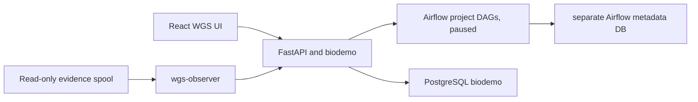

# WGS-only local/CCE platform design

## Release decision

This release replaces the mixed demo control plane with a WGS-only platform. It delivers the control plane, database, authentication, UI, observer, and paused Airflow topology. The WGS 3.9.3 workflow is still changing, so this release deliberately does not execute CCE, SGE, local Snakemake, or OBS transfer commands.

`WGS_EXECUTION_ENABLED=false` is a hard Phase 1 boundary. The FastAPI submit action returns HTTP 409, all three DAGs are paused at creation, and each DAG runner task fails closed even if a DAG is manually triggered. Enabling the environment variable alone cannot execute a workflow because the actual runner integration is deferred to Phase 2.

## Architecture

Only nginx is published. Airflow Web, PostgreSQL, Redis, backend, and observer stay on the Compose network. The observer has read-only evidence access and no kubeconfig, Docker socket, SSH key, or OBS credential. CCE administration remains outside containers. Private-line OBS credentials remain on node005 and are not copied into the release.

## Phase 1 contracts

- A manual request accepts only `pipeline=wgs`, `execution_mode=cce|sge|local`, a project name, and an approved `source_path`.
- The batch directory must contain a sample/family manifest, `FASTQ.MD5SUMS`, and `READY` written last.
- The platform records the request but cannot submit it while execution is disabled.
- The intake DAG is scheduled every ten minutes but is paused. When enabled in Phase 2 it only asks the internal API to scan WGS.
- The CCE and on-prem DAGs preserve project-stage topology, Airflow pools, and reschedule sensors without containing production runner commands.
- Active run pages poll about every five seconds and expose families, rules, pods, transfers, QC, logs, and files.

## State and data model

Business state is stored in `biodemo`, never in Airflow metadata tables. New records cover users, sessions, audit events, attempts, transfers, raw rule events, projected rule state, Kubernetes workload state, and four master-slot leases. Rule projection uses `planned`, `running`, `success`, `failed`, `blocked`, and `unknown_interrupted`; Kubernetes phase, reason, exit code, image, resource summary, and evidence path are preserved separately.

Evidence ingestion is idempotent by event identity. Restarting `wgs-observer` may reread files, but database uniqueness prevents duplicate rule events and pod state is updated by pod identity. Exact integration with the evolving `group_evidence.py` layout and incremental offset persistence remains Phase 2.

## Authentication and authorization

- `viewer`: authenticated reads only.
- `operator`: create requests and, after Phase 2 enablement, submit/resume/rerun-failed/cancel.
- `admin`: operator abilities plus account administration.

Passwords use salted scrypt hashes. Sessions use HttpOnly cookies; mutating calls require the session CSRF token. Login, logout, account changes, and run actions are audited. Apart from `/api/health` and login, anonymous API access is rejected in the production Compose profile.

## Phase 2 workflow integration

Phase 2 must pin the final WGS release before changing the execution gate. It must then implement and test:

1. controlled intake fingerprinting and READY-after-change alarms;
2. node005 restricted private OBS upload/download with `-vmd5` and atomic result publication;
3. CCE master submission through the approved BS10610 kubeconfig boundary;
4. `group_evidence.py` incremental rule and Pod publication;
5. identical Snakemake 9 logger contracts for CCE, SGE, and local;
6. real four-master lease recovery and fifth-run queuing;
7. result-manifest/MD5 reconciliation and final success calculation;
8. synthetic CCE, SGE, local, OOM, ImagePullBackOff, interruption, concurrency, and corrupt-download acceptance.

Do not enable execution until these are complete. In particular, do not infer production commands from the placeholder profiles in this release.

## Deployment and rollback

Deploy under `/mnt/biodevrwbi/33.chenjiucheng/project/airflow-WGS/releases/<release-id>` and atomically repoint `current` only after migration, health, login/RBAC, WGS-only capability, paused-DAG, and execution-denial checks pass. Use fresh named Postgres and Redis state for this WGS-only platform. Record exact obsolete platform paths/volumes before removing them; never prune globally and never delete FASTQ, WGS/NIPT workflow sources, references, or production results.

Because the final requirement is one release with no rollback release, destructive removal of old platform state is a post-acceptance step. If acceptance fails before removal, point `current` back and recreate application services without deleting data.
