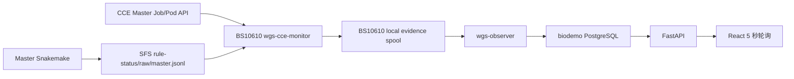

# WGS 4.1.0 Airflow + CCE 接入设计

> **历史设计，已停止作为实施依据。** 本文记录 WGS 4.0.1/4.1.0 阶段的
> 设计演进和候选实现，未描述当前 WGS 4.1.1 生产合同。2026-08-26 起，唯一
> 有效的接入设计为
> [`25_WGS_4_1_1_AIRFLOW_INTEGRATION_PLAN.md`](25_WGS_4_1_1_AIRFLOW_INTEGRATION_PLAN.md)。
> 本文中的旧 commit、旧 cce-pipeline 版本、旧 Master image、node005/BS10610
> 分工、15-task DAG 和终态 marker 只能作为历史记录，不能用于新实现或生产启用。

## 2026-08-24 implementation override

This section supersedes older 4.0.1 and node005/BS10610 split-host
descriptions below. The current integration uses WGS 4.1.0, confirmed
cce-pipeline commit `02adcecd85cc052b81330181a17d0377a742c39f`, a single
paused DAG `bio_wgs`, and one restricted operator boundary on node 200. Node
200 owns private OBS and kubectl; BS10610 Compose owns Airflow, FastAPI,
observer, PostgreSQL and the frontend but receives no cloud credentials.

The cloud cannot call FastAPI. Master Snakemake writes offline
`rule-event.v1` JSONL to SFS; node 200 incrementally pulls complete lines and
Master Job/Pod state into a shared spool; the kubeconfig-free observer writes
local biodemo PostgreSQL; the frontend polls FastAPI every five seconds.
Worker Pods are not continuously listed or displayed.

The WGS snapshot is
`wgs-v4.1.0-candidate-b72ebea-2178aa5b`, manifest SHA256
`5f3aa5c0496b1224a8ae61799550392d37ff8269a4596cdc2a9a00e80dcc4631`.
Execution remains disabled. See
`24_WGS_RUNTIME_INTEGRATION_DEVELOPMENT_STATUS.md` for the two unresolved
production interfaces: cce-pipeline's four-column FASTQ MD5 manifest versus
the approved no-Airflow-hash flow, and its missing structured transfer
progress spool. The Master image issue is resolved: a logger-only overlay on
the approved r2 base is pinned at RepoDigest `sha256:5d1d977f...` and preserves
Snakemake `9.24.0+biosan1`, Executor `0.6.4+biosan3`, and cce-pipeline `0.2.0`.

## 1. 文档依据与当前边界

本文以 BS10610 上 Airflow 自有 WGS 4.0.1 副本的实际代码为准：

- 源码：`/mnt/biodevrwbi/33.chenjiucheng/project/airflow-WGS/development/wgs`；
- 上游 commit：`6cb1255fc1b218c9b18fb931eb3b6a172afe907b`；
- 主要入口：`prepare/prepare_wgs_batch.py`；
- CCE Step 生成：`prepare/cce.py`；
- Master 入口：`huawei-cloud/scripts/run_cce_master_job.sh`；
- 分析 DAG：`WGS_cloud.smk`；
- 状态证据：`prepare/cce_run_state.py`、`collect_cce_run_evidence.sh`；
- 结果交付：`script/cce_delivery.py`。

本轮仍为文档设计，不修改或部署代码。当前服务器加载的 `bio_wgs_cce`、`bio_wgs_onprem` 和 `bio_wgs_intake_scan` 仍是 paused 遗留 DAG；目标 `bio_wgs` 尚未实现。

## 2. 关键纠正

### 2.1 FASTQ 不再单独计算 MD5

WGS 4.0.1 CCE 批次不生成或上传 `FASTQ.MD5SUMS`。Airflow 不应再设计以下任务：

```text
start_fastq_md5
wait_fastq_md5
verify_source_snapshot_after_md5
```

`prepare_wgs_batch.py` 负责样本筛选、FASTQ 配对、路径安全、普通文件和非空检查，并生成批次包。`Step1_upload_fastq.sh` 在真正上传时重新解析软链接并检查源文件仍为非空普通文件，同时读取文件长度。

代码仍对新上传对象使用 `obsutil cp -vmd5`。这里的 `-vmd5` 是 obsutil 单次传输选项，不是 Airflow 独立 MD5 阶段，也不会生成 FASTQ MD5 manifest。

### 2.2 上传后不再设置独立 FASTQ 验证任务

Airflow 不需要 `verify_input_obs` 或“上传后再次校验 FASTQ”任务。`Step1_upload_fastq.sh` 自己完成以下闭环：

1. 对目标对象执行 `obsutil stat`；
2. OBS 对象长度与本地文件一致且已有 MD5 metadata 时直接复用；
3. 缺失或不满足复用条件时使用 `obsutil cp -vmd5` 上传；
4. 任一上传失败则 Step1 非零退出；
5. 所有对象完成后最后写入 `FASTQ_UPLOAD_COMPLETE`。

`Step2_run.sh` 在启动 Master 前检查 OBS 挂载中的 `FASTQ_UPLOAD_COMPLETE` 和预期 FASTQ 是否存在且非空。这是 Step2 的启动前置条件，不是新的 Airflow task。

需要注意：现有复用判断不重新计算本地 FASTQ MD5，而是使用“长度一致且远端存在 MD5 metadata”。因此受控 FASTQ 链接目录必须保持不可变；如果源文件发生变化，应创建新 attempt/批次前缀，不能复用旧 `FASTQ_UPLOAD_COMPLETE`。

## 3. 目标单一 DAG

最终只保留一个 CCE DAG：

```text
bio_wgs
validate_request
→ prepare_wgs_batch
→ upload_fastq
→ launch_batch_master
→ wait_analysis_terminal
→ publish_results
→ download_and_verify_results
→ materialize_results
→ finalize_run
```

各阶段与 WGS 4.0.1 的对应关系如下：

| Airflow 阶段 | 4.0.1 代码入口 | 职责 |
|---|---|---|
| `validate_request` | 平台校验 | 校验 WGS、CCE、项目、批次和受控 FASTQ 路径，不读取大文件计算 MD5 |
| `prepare_wgs_batch` | `prepare_wgs_batch.py --run-mode cce` | 生成 sampleinfo、表型关键词、config、FASTQ 软链接和 CCE 批次包 |
| `upload_fastq` | `Step1_upload_fastq.sh` | 幂等上传/复用 FASTQ，最后写 `FASTQ_UPLOAD_COMPLETE` |
| `launch_batch_master` | `Step2_run.sh` | 创建批次专属 Master Job、注入三份元数据并启动 Snakemake |
| `wait_analysis_terminal` | Step3、SFS evidence、observer | 等待 `RUN_COMPLETE.json` 或 `RUN_FAILED.json`，持续展示 Rule 和 Master Pod |
| `publish_results` | `Step4_publish_results.sh` | 校验分析终态并将 SFS linkage 精确发布到 OBS，写 `READY` |
| `download_and_verify_results` | `Step5_download_verify.sh` | 下载结果 manifest、CRAM、结果包及 sidecar，校验结果长度与 MD5 |
| `materialize_results` | `Step6_materialize_results.sh` | 只消费已验证结果并原子物化到本地批次目录 |
| `finalize_run` | 平台终态对账 | 依据 native evidence、Rule reconciliation、Master 状态和结果交付状态完成业务 run |

Step7/Step8 是显式受门控清理，不属于成功 DAG，不自动执行。

## 4. Master Job 内部流程

`Step2_run.sh` 每批创建一个确定性的 Master Job，不使用固定 Master Deployment 或数据库 Master slot。它等待 Master Pod Ready，将以下文件通过标准输入原子写入 Pod：

```text
config.yaml
sampleinfo.tsv
phenotype_key_word_gene_list.txt
```

Master 随后执行：

```text
cloud_preflight
→ cloud_wgs_all
→ final dry-run
→ ANALYSIS_SUCCEEDED
→ DELIVERY_STAGED
→ RUN_COMPLETE.json
```

`cloud_wgs_all` 已包含业务分析和 SFS linkage 交付准备：

- 生产 WGS Rule；
- CRAM 及 CRAM MD5 sidecar；
- `results/<batch>.results.tar.zst` 及 MD5 sidecar；
- `payload-manifest.tsv`；
- `ANALYSIS_COMPLETE`。

因此 Airflow 不重新实现 Snakemake Rule，也不在 Master 完成后重复打包结果。最终 dry-run 必须包含 `Nothing to be done`。

## 5. Rule 与 Master Pod 监控方案

平台以 Rule 进度为主，只补充监视每批唯一的 Master Job/Pod；不采集 Worker Job/Pod 明细。



### 5.1 Rule 状态：Snakemake logger

logger 只安装在 Master 的 Snakemake 环境，不需要放进每个 Worker Pod。真实分析命令 `cloud_wgs_all` 增加 `--logger airflow-demo`，将事件写到普通 SFS：

```text
<run_root>/evidence/<run_id>/rule-status/raw/master.jsonl
```

事件至少包含：

```text
schema_version
event_id
analysis_id
attempt
pipeline_snapshot_id
run_label
stream_id
rule_instance_id
rule_name
wildcards
sample_id
layer
snakemake_jobid
event/status
timestamp
message
stdout_path/stderr_path（可用时）
```

Master logger 负责 `job_info/job_started/job_finished/job_error`，通过 Snakemake job ID 缓存 Rule、wildcards 和 sample 上下文。CCE 无法访问 FastAPI，因此 logger 不配置 backend URL，只追加 JSONL；写入失败必须使监控降级可见，但不能伪造 Rule 成功。

preflight 和 final dry-run 的终态由 native exit code/log 负责，不与正式 Rule stream 混写。group job 需要单独验收：一个 group error 必须能够投影到其成员 Rule，不能只显示一个匿名 group 失败。

### 5.2 Master Job/Pod 状态：BS10610 轻量 watcher

Pod 状态不由 Snakemake logger 采集。BS10610 上唯一持有最小化 kubeconfig 的 `wgs-cce-monitor` 只针对 Step2 已登记的批次 Master Job/Pod，按约五秒执行：

1. 通过批次 evidence-reader 增量读取 Rule JSONL；
2. 按 `analysis_id + attempt` 查询唯一的 Master Job 及其 Pod；
3. 保存 Master phase、conditions、resourceVersion、container state、reason、exit code、OOMKilled、ImagePullBackOff、image、node 和心跳时间；
4. 将 Rule 增量与 Master 状态原子写入 BS10610 本地 evidence spool；
5. Master Job/Pod 被 TTL 清除后，以已保存证据、`run-state.json` 和终态 marker 为准，不把 404 单独判为失败。

`wgs-cce-monitor` 是 BS10610 宿主机总体监控服务，不写在每个 DAG task 内；DAG 只登记/取消 run binding。Compose 内的 `wgs-observer` 不持有 kubeconfig，只按文件 cursor 和 event ID 幂等消费本地 spool。

### 5.3 Worker Pod 的处理原则

平台不轮询、不入库、也不在前端展示每个 Worker Job/Pod。4.0.1 原生 `jobs.ndjson` 可以继续作为 SFS 诊断证据保留，但不作为 Airflow 平台监控输入，因此无需建立 Rule→Worker Pod 的关联模型。

Worker 的提交失败、执行失败和重试结果由 Snakemake 汇总，最终反映为 Rule logger 的 `job_error`、后续重试事件或 Rule terminal 状态；需要深度排障时，再由管理员按 Snakemake job ID、Master 日志和原生 `jobs.ndjson` 临时查询 CCE。该排障能力不是常驻前端功能。

### 5.4 终态优先级

- Rule 当前状态以 Snakemake logger 投影为准；Worker 失败由 Snakemake 重试及 Rule 终态收敛，不根据单个 Worker Pod 直接改判整个分析。
- Master Pod 失败是批次级基础设施证据；仍需结合 `RUN_FAILED.json`、Master exit code 和未终结 Rule 进行对账。
- Master 中断且 Rule 没有 terminal event 时，Rule 标记 `unknown_interrupted`，不能保留 `running`。
- 分析成功必须有合法 `RUN_COMPLETE.json`、无冲突 `RUN_FAILED.json`、三个 exit code 为 0、manifest digest 一致和 `ANALYSIS_COMPLETE`。
- 整体业务成功还必须完成 Step4、Step5、Step6；Master Job `Complete` 本身不等于业务 run 完成。

## 6. 操作主机和凭据边界

WGS 4.0.1 上游脚本当前假设同一 operator 主机可同时访问 obsutil、SFS API 和 kubectl。Airflow 生产边界不同：

- node005：只持有私网 OBS 配置、obsutil 和结果传输所需的受限凭据；
- BS10610：运行 Airflow、受限 kubectl/CCE gate 和仅监视 Master 的 `wgs-cce-monitor`。

因此不能直接把完整 Step1-Step6 都放进 Airflow 容器执行。后续 adapter 需要保持 4.0.1 业务语义并拆分宿主机动作：

| 4.0.1 动作 | 执行边界 |
|---|---|
| Step1 FASTQ 上传 | node005 受限入口 |
| Step2 Master 创建/启动 | BS10610 受限 kubectl 入口 |
| Step3 evidence/Master 查询 | BS10610 `wgs-cce-monitor` |
| Step4 SFS→OBS 发布 | node005 执行发布；BS10610 执行 CCE 状态迁移 |
| Step5 结果下载验证 | node005 执行下载验证；BS10610 执行 CCE 状态迁移 |
| Step6 本地物化 | node005/批准的本地结果主机执行；BS10610 执行 CCE 状态迁移 |

OBS 配置不得复制到 Airflow 容器、SFS、evidence、数据库、仓库或日志。kubeconfig 不进入 observer 容器。所有入口只接受已登记 analysis/attempt、生成器冻结的路径和固定动作，不接受任意 shell。

## 7. 状态与进度展示

Airflow/业务阶段建议为：

```text
created
→ preparing
→ waiting_transfer_slot
→ uploading
→ waiting_cce
→ running
→ publishing
→ downloading
→ materializing
→ success
```

不再包含 `hashing`、`upload_verifying` 或独立 `verify_input_obs`。原生 SFS 状态仍保留 `FASTQ_READY`，但它表示 Master 已接受上传完成标记，不表示 Airflow 执行了独立 FASTQ MD5/验证任务。

前端活动任务每五秒查询一次：

- 总体阶段来自 Airflow/biodemo；
- Rule 表来自 logger JSONL；
- Master 状态来自 Kubernetes watcher；
- 传输进度来自 node005 progress spool；
- 终态来自 native evidence 与 Step4-Step6 对账。

目标可见延迟不超过十秒。ETA 只在有至少三个同 snapshot 成功批次时显示，否则标记“暂无可靠估算”。

## 8. 后续实现门禁

当前继续保持：

```text
WGS_EXECUTION_ENABLED=false
all current WGS DAGs paused
real CCE/OBS execution disabled
```

解除门禁前至少完成：

1. 单一 `bio_wgs` DAG 和 observer 扫描；
2. 去除独立 FASTQ MD5 与上传后验证 task；
3. BS10610/node005 restricted adapter 拆分；
4. Master logger 安装、参数接线及 group job 事件测试；
5. Rule JSONL 增量读取和批次 Master Job/Pod watcher；
6. observer 重启/文件截断/部分行幂等测试；
7. Rule 失败、Master OOM、ImagePullBackOff、Master 中断和 TTL 404 测试；
8. Step4-Step6 结果发布、错误 MD5、重下和原子物化测试；
9. 最小真实批次及并发验收。

本文只完成代码驱动的设计纠正，不代表上述实现已经完成。
