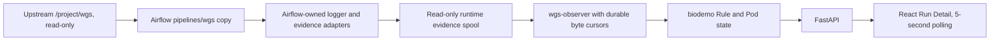

# Airflow-Owned WGS Copy And Observability Design

## Scope decision

Airflow follows the WGS workflow maintained at
`/mnt/biodevrwbi/33.chenjiucheng/project/wgs`, but never modifies that upstream
working tree. Development starts from a content snapshot copied into
`pipelines/wgs` in the Airflow repository. All Airflow logger, evidence,
runner-adapter, and monitoring changes occur only in that copy.

The imported source identifies itself as WGS V4.0.1 and Git commit
`136da1ad9e45ac1abcbeb3efa40bb2e2269b6ab9` on
`dev_CJC_4.0.1_cloud`. The source working tree also contains uncommitted CCE
image changes in `cfg/profiles/cce/config.yaml` and
`cfg/profiles/cce/runtime.yaml`; the user explicitly requested that they be
included without committing them upstream. Therefore this import is recorded
as a development snapshot, not as a frozen pipeline release.

## Snapshot boundary

The import excludes the upstream `.git` directory and adds
`SOURCE_PROVENANCE.json`. Provenance records the upstream path, branch, commit,
dirty paths, snapshot timestamp, archive SHA256, and development status. A new
upstream import creates a new provenance identity; it never silently changes
the identity of historical analysis runs.

The source tree is read-only from the perspective of airflow-demo work. Copy
operations compare upstream Git status before and after. Airflow releases carry
the copied workflow under `pipelines/wgs`, so deployed execution never reads
live files from `/project/wgs`.

## Monitoring architecture

The existing completed 3.9.3 evidence is retained only as a field-shape
reference for synthetic observer tests. It is not the registered workflow
release and is not used as the execution source.

The copied V4.0.1 tree does not currently contain the complete
`group_evidence.py` and Rule JSONL logger implementation previously inspected
in `wgs-3.9.3-cloud`. Platform integration therefore adds adapters to the
Airflow copy, using the established schema-version-1 Rule and Pod event format
so the biodemo observer and frontend contract stay stable across workflow
updates. Business Rules are not changed in this phase.

## Release and run identity

The platform catalog identifies the snapshot by an Airflow pipeline snapshot
ID, upstream commit, imported-tree manifest hash, and provenance status. New
runs pin this snapshot ID and observer schema version in biodemo. Because this
copy contains upstream-uncommitted files, execution remains disabled and DAGs
remain paused. Promotion to an executable release requires a later, explicit
accepted snapshot; it does not happen automatically when upstream changes.

## Evidence ingestion

Platform-owned binding JSON maps each `analysis_id + attempt` to the exact
evidence directory and snapshot ID. Paths are normalized below the configured
evidence root. The observer stores a cursor per JSONL file, reads only complete
newline-terminated records, commits raw events, projections, and cursor offsets
in one transaction, and resumes after restart. Partial lines wait; file
rotation replays safely; malformed records produce visible diagnostics without
advancing past the bad line.

Rule projection supports `rule_planned`, `job_info`, `job_started`,
`job_finished`, `job_error`, and final reconciliation to `planned`, `running`,
`success`, `failed`, `blocked`, or `unknown_interrupted`. Pod projection keeps
Kubernetes phase, reason, exit code, image, node, resource summary, and event
ordering. Existing authenticated `/rules` and `/pods` APIs read biodemo only;
they never read SFS or Kubernetes during a browser request.

## Security and deployment boundary

`wgs-observer` receives only biodemo credentials, the snapshot catalog, the
binding directory, and a read-only evidence mount. It receives no kubeconfig,
OBS credential, SSH key, Docker socket, privileged mode, host network, or
published port. Private OBS configuration remains on node005.

This delivery uses synthetic fixtures derived from existing event shapes. It
does not run CCE, OBS, SGE, local Snakemake, or the WGS workflow. It does not
modify or delete upstream workflow files, FASTQ, references, results,
historical evidence, or platform volumes. `WGS_EXECUTION_ENABLED=false` and
paused WGS DAGs remain mandatory.

## Acceptance

- The Airflow copy contains 109 upstream files plus Airflow provenance/docs and
  no upstream `.git` directory.
- The archive SHA256 matches
  `fe9a691e5dd290537b29e90089adf1b78aea250ace8e61ee2a664ea3e4ecad56`.
- Upstream Git status is unchanged after import.
- New runs record the Airflow snapshot ID, not a 3.9.3 release ID.
- Synthetic partial-line, restart, replay, Rule, Pod, API, frontend, and
  observer-isolation tests pass remotely.
- Submission remains HTTP 409, all WGS DAGs stay paused, and no workflow command
  is executed.
