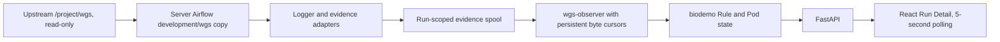

# Server-Side WGS Development Copy And Observability Design

## Corrected location boundary

The upstream WGS working tree is
`/mnt/biodevrwbi/33.chenjiucheng/project/wgs`. Airflow integration must not
modify it. The Airflow-owned development copy lives on BS10610 at:

```text
/mnt/biodevrwbi/33.chenjiucheng/project/airflow-WGS/development/wgs
```

It is deliberately outside the live `current` symlink and all immutable
`releases/*` directories. Development changes occur in this server-side copy.
Only after acceptance is the resulting copy packaged into a new Airflow
release. Local `D:\pipeline\airflow-demo` does not contain the copied WGS
workflow.

## Imported snapshot

The copy contains the current upstream worktree at Git commit
`136da1ad9e45ac1abcbeb3efa40bb2e2269b6ab9`, branch
`dev_CJC_4.0.1_cloud`, including its uncommitted changes to:

- `cfg/profiles/cce/config.yaml`;
- `cfg/profiles/cce/runtime.yaml`.

The upstream `.git` directory is excluded. The server copy contains
`SOURCE_PROVENANCE.json` and `SNAPSHOT_MANIFEST.sha256`. Its manifest file has
SHA256 `16c2fb71e58c58ce99ecf964a7003b231149110a09a23c3b21be247ca134f2ab`.
Because it includes uncommitted upstream files, it is a development snapshot,
not a frozen executable release.

Copying is performed through a sibling temporary directory followed by an
atomic rename. Upstream Git status is checked before and after and must remain
unchanged. A future refresh creates another explicitly identified snapshot;
it does not overwrite a copy used by active or historical analyses.

## Development and source-of-truth model

The local airflow-demo Git repository remains the source of truth for the
FastAPI, database, observer, frontend, DAG, Compose, and documentation code.
The server-side WGS copy is the source of truth for WGS-specific integration
changes such as logger adapters and evidence emitters. Each server-side change
must be listed in `HANDOFF.md` with a checksum and copied into the final server
release during deployment.

Business Rule changes do not originate in the Airflow copy. They are made in
the upstream WGS repository and imported as a new snapshot. Airflow-specific
logger/evidence wiring must avoid changing Rule outputs, dependencies, resource
requests, or command behavior.

## Monitoring flow



The development snapshot identifies itself as WGS V4.0.1. Existing completed
3.9.3 evidence may be used only as a schema-shaped synthetic test reference;
it is not the execution source or registered WGS release.

The server copy does not currently include the full Rule JSONL logger and
`group_evidence.py` implementation previously available in the old cloud
tree. Airflow-specific adapters are added only to the server copy and emit the
established schema-version-1 Rule and Pod event contract.

## Snapshot and run identity

The platform catalog records a snapshot ID, upstream commit, snapshot manifest
hash, server development path, status, and Rule event schema version. New runs
pin that snapshot ID in biodemo. They never use the mutable upstream path at
runtime.

This imported snapshot remains execution-disabled. `WGS_EXECUTION_ENABLED` is
false and all WGS DAGs remain paused. A later explicit acceptance promotes a
specific manifest to an executable server release; source-directory changes
never promote themselves automatically.

## Incremental observer contract

A platform-owned binding maps each `analysis_id + attempt` to the exact
run-scoped evidence directory and snapshot ID. Paths must resolve below the
configured read-only evidence root. The observer stores one database cursor
per JSONL file and commits raw events, Rule/Pod projections, and the new byte
offset in one transaction.

Only complete newline-terminated records are consumed. A partial trailing line
waits for completion. Restart resumes at the committed offset. File truncation
or replacement triggers safe replay. Malformed complete JSON stops that file
at the bad record and exposes a diagnostic while other bound files continue.

Rule projection supports `rule_planned`, `job_info`, `job_started`,
`job_finished`, and `job_error`, with final states `planned`, `running`,
`success`, `failed`, `blocked`, and `unknown_interrupted`. Pod projection keeps
Kubernetes phase, reason, exit code, image, node, resources, and event order.
Authenticated `/rules` and `/pods` API requests read biodemo only and never
call Kubernetes or traverse SFS.

## Security and acceptance boundary

`wgs-observer` receives a read-only evidence mount, binding/catalog files, and
biodemo credentials only. It receives no kubeconfig, OBS credential, SSH key,
Docker socket, privileged mode, host network, or published port. Private OBS
configuration remains on node005.

This delivery uses synthetic event fixtures only. It does not run CCE, OBS,
SGE, local Snakemake, or the WGS workflow. Acceptance requires:

- server development copy has 111 files, no `.git`, and a verified manifest;
- upstream status and live `current` symlink remain unchanged;
- new runs record the server snapshot ID rather than a 3.9.3 release;
- partial-line, restart, replay, Rule, Pod, API, frontend, and isolation tests
  pass remotely;
- submission remains HTTP 409 and all WGS DAGs stay paused;
- no production input, result, reference, historical evidence, or platform
  volume is deleted or rewritten.
