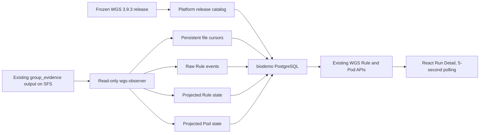

# WGS 3.9.3 Release Registration And Observability Design

## Status and scope

This design implements the first two approved T130 items only:

1. register the already frozen and previously tested WGS 3.9.3 cloud pipeline as a platform release;
2. complete read-only Rule and Pod evidence ingestion from the existing CCE evidence format into biodemo and expose it through the existing WGS UI.

The WGS pipeline is not modified, republished, revalidated, or executed in this change. CCE, OBS, SGE, local Snakemake, result download, four-run concurrency, and execution enablement remain outside this delivery. Verification uses synthetic fixtures shaped from existing completed-run evidence only.

## Confirmed upstream contract

The frozen pipeline root is:

```text
/mnt/biodevrwbi/33.chenjiucheng/project/wgs-3.9.3-cloud
```

The inspected completed release identifies itself as:

```text
release-38f2d5e-publishdirect-27e6daf20d34
```

Its immutable-publication contract already includes `PIPELINE_READY`, `PIPELINE_MANIFEST.sha256`, and the existing pipeline publication tooling. The platform records these identifiers and locations; it does not regenerate or independently bless a second release.

The existing Rule event contract is `schema_version=1`. Rule events are append-only JSONL under `rule-status/raw/*.jsonl` and use the existing `rule_planned`, `job_info`, `job_started`, `job_finished`, `job_error`, and `group_error` event names. Pod and Job observations are append-only JSONL under `raw/pod-events.jsonl`, `raw/pod-metrics.jsonl`, and `raw/job-events.jsonl`.

## Architecture



`wgs-observer` remains a Compose service on BS10610. It receives only a read-only evidence mount and biodemo credentials. It does not receive kubeconfig, OBS credentials, an SSH key, or the Docker socket. Existing CCE collection remains the responsibility of the frozen `group_evidence.py` process.

## Release catalog

The platform owns a versioned WGS release catalog file. One entry contains:

- stable platform release ID;
- pipeline name and semantic version;
- upstream immutable release name;
- upstream source root and SFS release root;
- `PIPELINE_READY` and manifest reference paths;
- Rule event schema version;
- allowed execution modes;
- lifecycle state `approved` or `retired`.

The initial entry is approved but execution-disabled. New WGS 3.9.3 patches or later WGS versions are introduced by adding a new catalog entry and changing the configured default after contract validation. Existing analysis records keep their original release ID, so historical monitoring does not change when the default advances.

Run creation copies `pipeline_release_id` and `rule_event_schema_version` into the run parameters. Submission continues to return HTTP 409 while the platform execution gate is disabled.

## Evidence identity and discovery

The observer consumes a platform-owned run binding file for each analysis attempt. The binding maps:

```text
analysis_id + numeric attempt
    -> upstream run_label
    -> exact evidence attempt root
    -> pipeline_release_id
```

Only normalized evidence paths below the configured read-only evidence root are accepted. Directory globbing does not infer patient or analysis identity from arbitrary historical evidence directory names. A missing, malformed, escaping, or conflicting binding is rejected and recorded as an observer error without changing run state.

This explicit binding resolves the difference between biodemo numeric attempts and upstream textual attempt identifiers such as `full-rerun-20260810-01`.

## Incremental JSONL cursor contract

The observer stores one database cursor per bound file. A cursor contains:

- `analysis_id` and numeric attempt;
- normalized path relative to the evidence root;
- source file identity derived from device/inode when available, otherwise a stable metadata fingerprint;
- committed byte offset;
- last complete line number;
- last observed size and modification time;
- last successful ingestion timestamp and last error.

Each poll opens the file read-only at the committed byte offset. Complete newline-terminated records are parsed in order. A trailing partial line is retained by leaving the cursor before that line. The database transaction writes raw events, projections, and the new cursor offset together. A crash before commit replays the records; event uniqueness makes replay idempotent. A crash after commit resumes at the committed offset.

If a file shrinks or its identity changes, the observer treats it as rotation or replacement. It resets the cursor to zero and safely replays the file. Existing raw-event uniqueness and Pod event ordering prevent duplicate or older observations from corrupting the projected state.

Malformed complete JSON lines do not advance the cursor. The file records an actionable error containing relative path and line number; other bound files continue to ingest.

## Rule event normalization

The observer preserves every accepted upstream Rule event in `rule_event_raw`. Because the upstream schema does not provide `event_id`, the platform event ID is the SHA256 of the release ID, run label, stream ID, event name, timestamp, job ID, Rule instance ID, and canonical JSON payload.

Rule projection follows the upstream reconciliation semantics:

- `rule_planned` creates or updates a `planned` Rule instance;
- `job_info` maps `(stream_id, job_id)` to `rule_instance_id` and supplies Rule name/layer metadata;
- `job_started` changes the resolved instance to `running`;
- `job_finished` changes it to `success`;
- definitive `job_error` changes it to `failed`;
- final `rule-status-summary.json` reconciles remaining started instances to `unknown_interrupted` and unstarted downstream instances to `blocked` when the upstream run terminates unsuccessfully.

Master and Worker duplicates use the existing upstream preference: when Worker lifecycle evidence exists for a Rule instance, Worker evidence is authoritative for timing and terminal state. Unknown schema versions and unsupported event names are preserved as ingestion errors and do not silently mutate Rule state.

## Pod and Job normalization

`pod-events.jsonl` is the primary Pod phase stream. Its `event_key` is the event identity and `pod_hash` is the workload projection key. The platform maps:

- `job` to `job_name`;
- `phase` to Kubernetes phase;
- `observed_at_utc` to observation time;
- `resource_version` to event ordering metadata.

Later Kubernetes resource versions supersede earlier ones. `pod-metrics.jsonl` enriches the same Pod record with CPU and memory usage without replacing phase. `job-events.jsonl` enriches Job status and supports failure reconciliation. Final Pod evidence supplies reason, exit code, image, node, OOM, and ImagePullBackOff details when present.

The API response keeps Kubernetes phase separate from platform display status. No Pod failure by itself marks an analysis successful or failed in this delivery because execution and final result reconciliation remain disabled.

## API and frontend behavior

The existing authenticated endpoints remain the public contract:

```text
GET /api/runs/{analysis_id}/rules
GET /api/runs/{analysis_id}/pods
```

They read projected biodemo state only. They never traverse SFS or call Kubernetes during a user request. Responses include attempt, event timestamp, Rule layer/status, Pod phase/reason/exit code, and evidence freshness where available.

The existing WGS Run Detail `Rules` and `Pods` tabs remain the UI. Active runs poll approximately every five seconds. The overview displays the registered pipeline release ID and the latest observer freshness/error state. RBAC remains unchanged: viewer, operator, and admin may read monitoring state; anonymous users may not.

## Failure handling and recovery

- Missing evidence files mean `not observed yet`, not failure.
- Invalid run bindings are isolated and visible as observer errors.
- Partial JSONL writes wait for completion without losing bytes.
- Malformed complete records stop that file at the bad record and retain a diagnostic.
- Observer restart resumes from biodemo cursors.
- Database transaction failure leaves the cursor unchanged and safely replays.
- File replacement triggers controlled replay.
- Unsupported Rule schema never silently projects a state.
- API and frontend continue showing the last committed state when the observer is temporarily unavailable.

## Security and data boundaries

- The observer evidence mount is read-only.
- The observer has no kubeconfig and cannot create, modify, or delete CCE resources.
- Private OBS configuration remains only on node005 and is not copied into Compose, SFS evidence, repositories, or logs.
- Evidence paths are normalized and constrained below the configured evidence root.
- Raw evidence payloads are not accepted through public user APIs.
- The delivery does not delete or rewrite pipeline, FASTQ, reference, result, or historical CCE evidence data.

## Verification and deployment

Verification is platform-only and uses synthetic fixtures copied from the inspected event shapes. It must prove:

1. release catalog selection and immutable run pinning;
2. partial-line waiting and later completion;
3. incremental append without full-file reprocessing;
4. restart from persisted cursor;
5. crash-safe replay and event idempotency;
6. file truncation/replacement replay;
7. Rule job-to-instance correlation and terminal projection;
8. Pod phase ordering and metrics enrichment;
9. unsupported schema and malformed JSON diagnostics;
10. authenticated API and existing five-second frontend polling behavior;
11. Compose isolation: observer has read-only evidence only and no kubeconfig, OBS, SSH, Docker socket, or published port;
12. execution remains disabled, all WGS DAGs remain paused, and no workflow command is invoked.

Backend, frontend, migration, and Compose tests run on the remote development/runtime node according to repository policy. Deployment creates a new Airflow platform release, migrates biodemo without deleting its volume, verifies service health and synthetic monitoring, then atomically updates `current`. No WGS workflow validation or execution is part of acceptance.

## Deferred work

The following remain explicit later work: CCE submission, OBS upload/download, SGE/local runners, automatic intake execution, four-master lease recovery, result MD5 reconciliation, final run success calculation, and execution-gate enablement.
